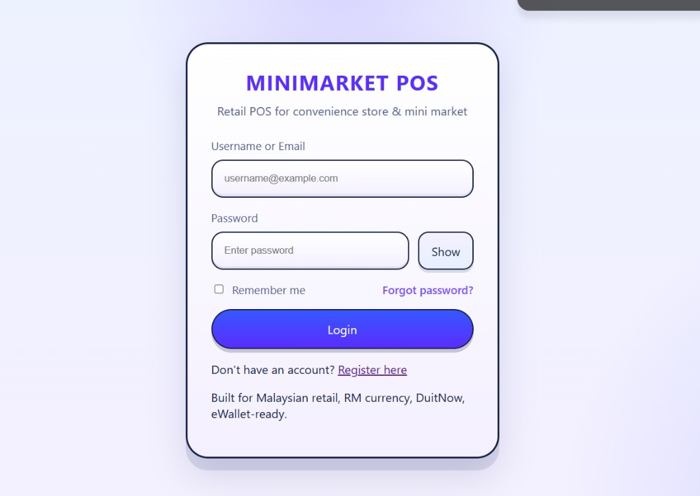
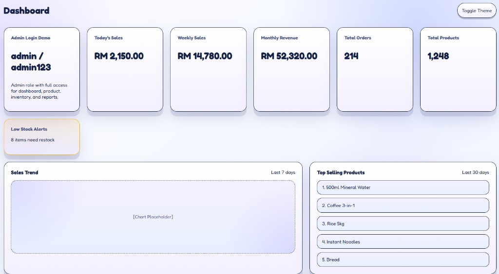
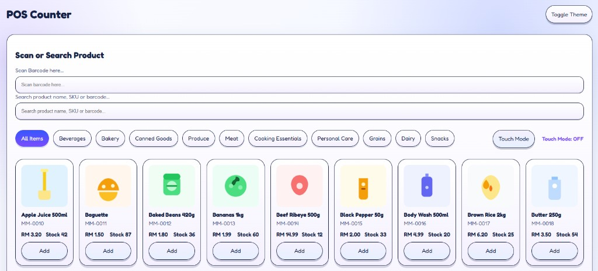
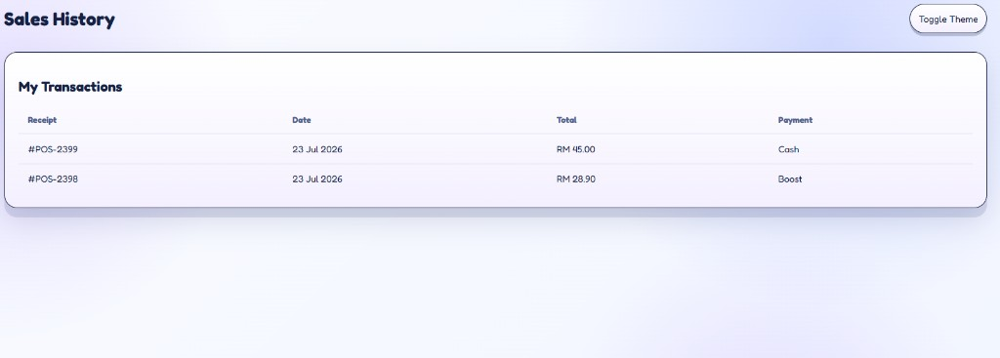

# MiniMarket POS

Retail point-of-sale system for Malaysian convenience stores and mini markets. Built with PHP for XAMPP, RM currency, and cashier / admin workflows.

## 快速开始（XAMPP）

1. 把项目放在 `C:\xampp\htdocs\pos_system`
2. 启动 XAMPP 的 **Apache**（本项目目前用 JSON 存数据，不必先建 MySQL）
3. 打开 http://localhost/pos_system/
4. 用演示账号登录：
   - Admin: `admin` / `admin123`
   - Cashier: `rina` / `cashier123`
5. Admin 可进 Dashboard、产品、库存、报表等；Cashier 主要用 **POS Counter** 和 **Sales History**
6. 需要新账号可在登录页点 **Register here**（新用户默认为 cashier）

忘记密码：打开 `forgot-password.php`，输入已注册邮箱（重置流程页面已提供；完整发信逻辑可按需要再接）。

## Features

- Admin and cashier roles with role-based navigation
- Dashboard with sales stats, low stock alerts, and recent transactions
- POS Counter: barcode scan, product search, category tabs, touch mode
- Shopping cart, customer select, and payment flow (Cash / eWallet-ready)
- Product catalog with SKU, barcode, category, price, and stock
- Sales history for cashiers; sales management for admins
- Customers, suppliers, inventory, reports, users, and settings pages
- Light / dark theme toggle
- Registration and session-based login (hashed passwords)
- Designed for Malaysian retail: RM, DuitNow / eWallet-ready UI copy

## Screenshots

| Login | Dashboard |
|:---:|:---:|
|  |  |

| POS Counter | Sales History |
|:---:|:---:|
|  |  |

## Folder structure

```
pos_system/
├── api/                 Auth, products, print helpers
├── assets/              CSS, JS, product images
├── data/                users.json, products.json
├── docs/screenshots/    UI screenshots
├── partials/            Shared header / footer layout
├── index.php            Dashboard
├── pos.php              POS Counter
├── history.php          Cashier sales history
├── products.php         Product management
├── inventory.php
├── customers.php
├── suppliers.php
├── sales.php
├── reports.php
├── users.php
├── settings.php
├── login.php
├── register.php
├── authenticate.php
└── logout.php
```

## 1. XAMPP setup

1. Copy this folder to `C:\xampp\htdocs\pos_system`
2. Start **Apache** in XAMPP
3. Open: http://localhost/pos_system/
4. You should land on login (or be redirected there)
5. Sign in with a demo account, or register a new cashier account

Demo accounts (also shown on the Dashboard when logged in as admin):

| Role | Username | Password |
|------|----------|----------|
| Admin | `admin` | `admin123` |
| Cashier | `rina` | `cashier123` |

User data is stored locally in `data/users.json` (**gitignored** — never commit real accounts). Products are in `data/products.json`.

First-time setup for users:
1. Copy `data/users.example.json` → `data/users.json`, **or**
2. Delete `data/users.json` and let the app recreate demo admin / cashier accounts on next login attempt.

## 2. Roles

**Admin**

- Dashboard, Sales Management, Product Management, Inventory
- Customers, Suppliers, Reports, Users, Settings

**Cashier**

- POS Counter (scan / search / add to cart / checkout)
- Sales History (own transactions)

## 3. POS Counter

1. Log in as cashier (or admin if you open `pos.php` directly where allowed)
2. Scan a barcode, or search by name / SKU / barcode
3. Filter by category tabs (Beverages, Bakery, Produce, …)
4. Optional: turn on **Touch Mode** for larger tap targets
5. Add items to the cart, choose customer and payment method
6. Complete sale and use receipt / print helpers as needed

Sample products include items like Apple Juice 500ml (`MM-0010`), Baguette, Beef Ribeye, etc., with RM prices and stock counts.

## 4. Theme

Use **Toggle Theme** in the top bar to switch light / dark. Preference is saved in the browser (`localStorage`).

## 5. Stack

- PHP 8+ (sessions, `password_hash` / `password_verify`)
- HTML / CSS / JavaScript
- Apache (XAMPP)
- JSON file storage under `data/` (no MySQL required for the current scaffold)

## 6. Notes / roadmap

- Core UI and authentication flows are in place
- Dashboard numbers and some list pages still use demo / placeholder data in places
- Full transaction persistence, ESC/POS printer agent, and deeper reporting can be extended later
- Keep `data/*.json` out of public writes in production; do not commit real production credentials if you later add a DB config

## System flow

1. User logs in (or registers as cashier)
2. Session stores id, name, role, username, email
3. Sidebar shows pages allowed for that role
4. Cashier sells on POS Counter; admin manages catalog / inventory / reports
5. Sales history and dashboard reflect activity (live or demo, depending on page)

## Security notes

- Passwords are stored with `password_hash()`
- Failed login attempts and account lock are supported in `api/auth.php`
- Sessions are regenerated after successful login
- Optional “Remember me” cookie stores username only (httponly)
- Prefer changing demo passwords before any real store use
- `.gitignore` hides `data/users.json`, `.env`, and local DB/config secrets
- Only commit `data/users.example.json` (demo accounts), never real emails or password hashes

## License

This project is licensed under the [MIT License](LICENSE).
